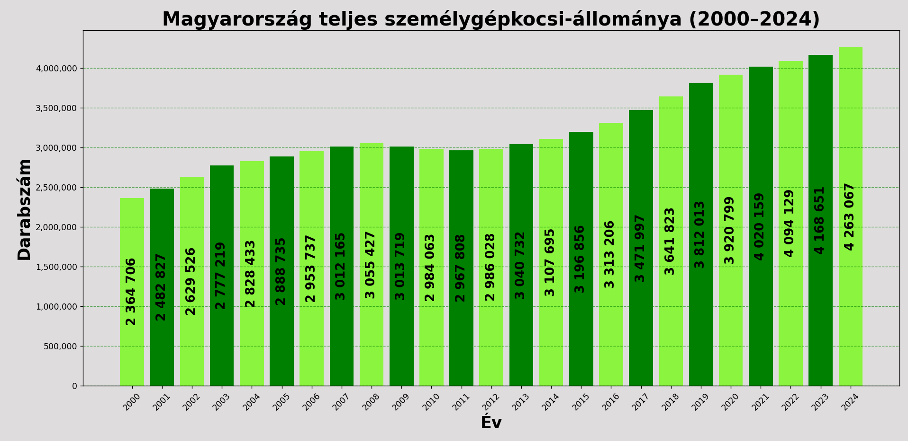
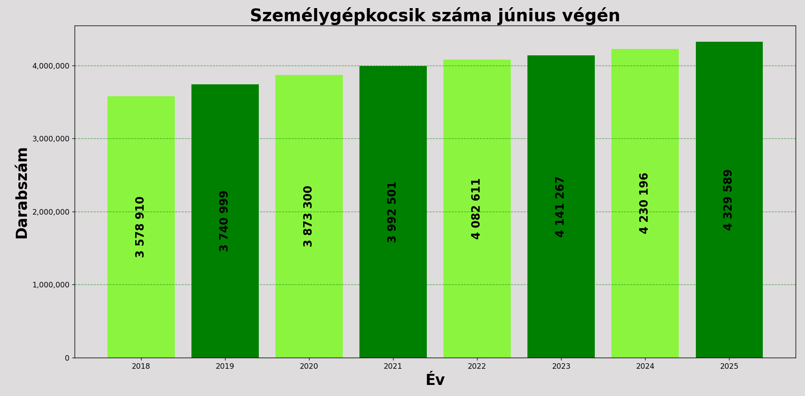
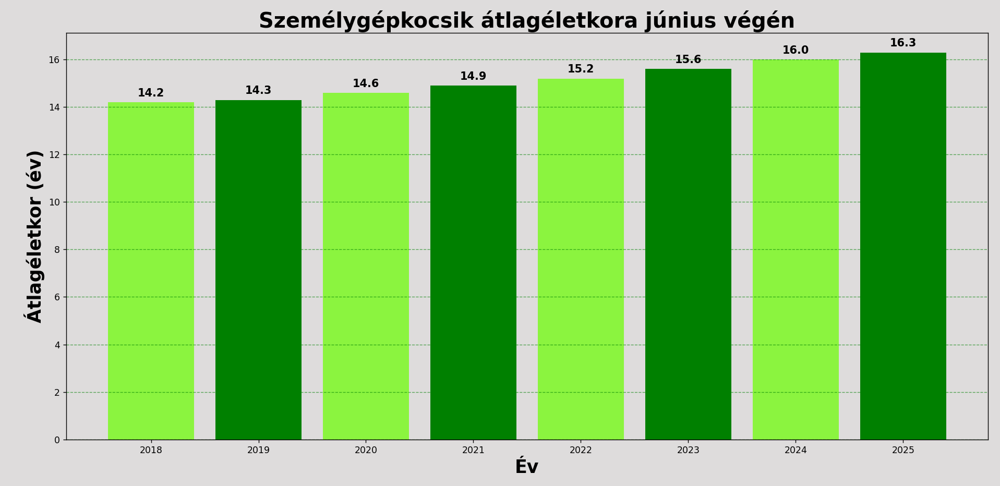
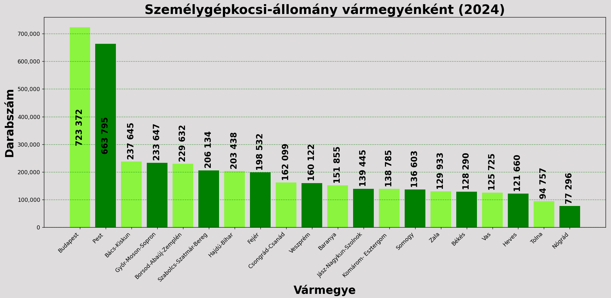
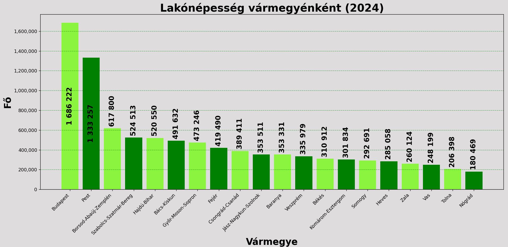
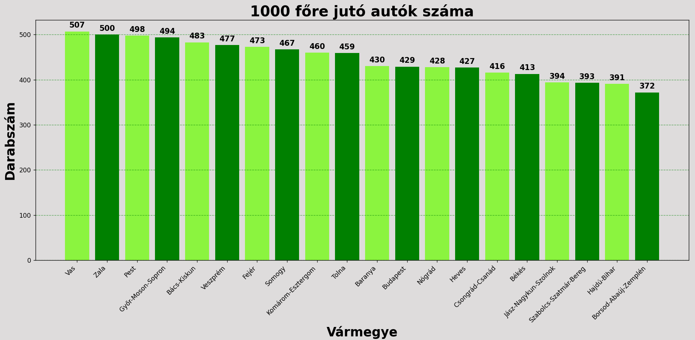

Mesterséges Intelligencia Mérnöki Alkalmazásai beadandó<br>
Kalmár Csaba - Zsoldos Gellért László - Simon Barnabás

<h1 align="center">A hazai autóállomány szerkezeti elemzése és nemzetközi összefüggései</h1>

Magyarországon és a világ viszonylatban is sokat változtak az autózási szokások az elmúlt két évtizedben. Tanulmányunkban ezeket a változásokat és az őket kiváltó okokat gyűjtöttük össze.<br><br>


### Teljes állomány
Megfigyelhető, hogy a 2008-as világválság hatásán kívűl országunk személygépkocsi-állománya folyamatosan bővült. Érdekes módon a növekedést a Covid-19 utáni gazdasági stagnálás és az európai autóipar visszaesése sem lassította le, sőt 2025-ben több, mint 100.000 új gépjármű lett regisztrálva az országban.


<div align="center">(1. ábra)</div>
<details>
<summary>Futtatás</summary>

``` bash
py teljes_allomany.py
```
</details>


<div align="center">(2. ábra)</div>
<details>
<summary>Futtatás</summary>

``` bash
py junius_allomany.py
```
</details>

### A gépkocsiállomány átlagéletkora

Az is látszik, hogy bár egyre több autó van forgalomban, a teljes állomány folyamatosan elöregedik. A trendek szerint 3 évente 1 évvel növekszik az átlagéletkor. Amellett, hogy az újabb, kis fogyasztású autók sokkal több ideig tudnak hiba mentesen forgalomban maradni, látszik, hogy a gazdasági helyzet miatt inkább a használt autók felé fordul a lakosság nagy része.


<div align="center">(6. ábra)</div>
<details>
<summary>Futtatás</summary>

``` bash
py atlageletkor.py
```
</details>

### Vármegyék szerint
Látható, hogy a nyugati megyékben minden második ember rendelkezik autóval és az ország legszegényebb részein is minden harmadik ember autóval jár. Az országos átlag 2025-ben 454 autó volt 1000 főnként. Érdekes módon Budapest is elmarad az országos átlagtól. Ez valószínűleg a túlsúlyban lévő tömegközlekedést választók miatt lehet.



<div align="center">(3. ábra)</div>
<details>
<summary>Futtatás</summary>

``` bash
py megyek_allomany.py
```
</details>



<div align="center">(4. ábra)</div>
<details>
<summary>Futtatás</summary>

``` bash
py lakossag.py
```
</details>



<div align="center">(5. ábra)</div>
<details>
<summary>Futtatás</summary>

``` bash
py fejenkent.py
```
</details>


